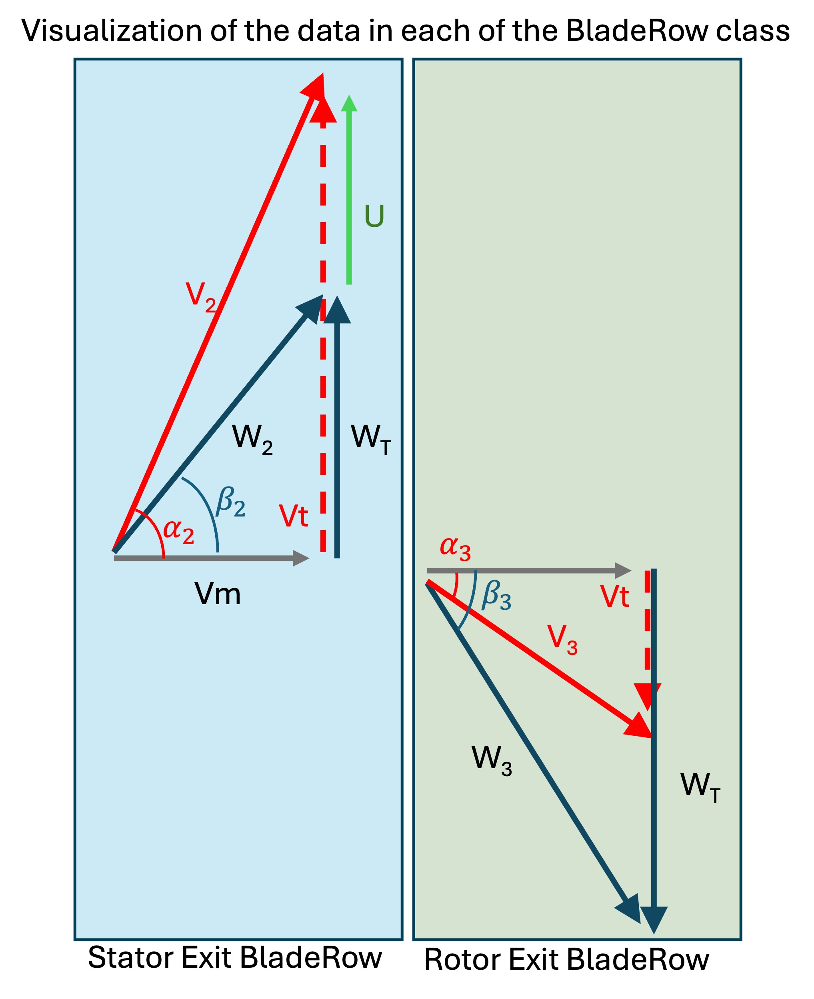

# Turbo Design 3 
This tool is a streamline turbomachinery design tool solving the radial equilibrium equations. It can be used for designing compressors and turbines. The designs can have counter rotating stages, different working fluids, and cooling. The intent of this tool is to enable added flexibility in which loss models are used. Because it's a python, it can connect with custom machine learning based loss models.

# Data Stucture and Velocity Triangles
## Compressors
Coming soon! 

## Turbines
Below is an example of a velocity triangle for a Turbine. Work is computed using `Work = U*(Vt1-Vt2) [Joules]`; Note: `Power = massflow * Work [Watts]`. For a turbine you want to have a huge Tangential velocity exiting the stator and a minimal tangental velocity leaving the rotor in order to extract the most work as possible.

Turbodesign keeps track of the all flow properties leaving the stator and leaving the rotor. The word "leaving" and "all" are key. The picture below shows the velocity triangles and each semi-transparent block shows the data that is contained in each `BladeRow` class. BladeRow for stator has rowtype of stator so it knows it's the data leaving the stator. It also keeps track the peripherial velocity `U` that the flow will see as it leaves the stator. 

# Getting Loss Models working
Loss models need to be built. I have stored set of models on github as .pkl files. They should automatically download but depending on your python version, the pickle binaries may have issues reading. 

Another way to generate them is to navigate to *turbo-design/references/Turbines/AinleyMathieson* (KackerOkapuu, Traupel, CraigCox) and run `python build_dataset.py`. This will create the loss models and save it to the .cache folder for Linux and Mac and for windows it will save to a different .cache folder in your home directory.  
https://colab.research.google.com/github/nasa/turbo-design/blob/main/examples/
# Examples 
## Turbines
[OptTurb](https://colab.research.google.com/github/nasa/turbo-design/blob/main/examples/optturb-turbine/optturb.ipynb) OptTurb is part of Paht's PhD work. It's a single stage HPT Turbine designed for Purdue's Experimental aeroThermal LAb (PETAL). It's an excellent candidate for verification because it can be easily modeled using a spreadsheet [OptTurb-SingleStage.xlsx](https://github.com/nasa/turbo-design/blob/main/examples/optturb-turbine/optturb-fixed_pressure_loss2.xlsm) 

[OptTurb-multistage](https://colab.research.google.com/github/nasa/turbo-design/blob/main/examples/optturb-multistage/optturb-multistage.ipynb) Multi-stage example of OptTurb. This is based off a meanline spreadsheet model [OptTurb-MultiStage.xlsx](https://github.com/nasa/turbo-design/blob/main/examples/optturb-multistage/multistage-fixed_pressure_loss2.xlsx) 

[Radial Turbine](https://colab.research.google.com/github/nasa/turbo-design/blob/main/examples/radial-turbine/radial_turbine-1D.ipynb) Radial Turbine example comparison with CFD Solution. This is a NASA internally developed turbine. It is not optimal but it works.  

[3 Row Steady](https://colab.research.google.com/github/nasa/turbo-design/blob/main/examples/3RowSteady-1D/3RowSteady.ipynb) 3 Row Steady comparison with a CFD Example from Aerodynamic Solutions.  

## Building Turbine Loss Models from Correlations
The loss correlations below were estimated using Axial steam turbines. Correlation figures are extracted and surface fitted. Each of these tutorials shows how to create and save the correlation files. 

[Ainley Mathieson](https://colab.research.google.com/github/nasa/turbo-design/blob/main/references/Turbines/AinleyMathieson/ainley_mathieson.ipynb)

[Craig Cox](https://colab.research.google.com/github/nasa/turbo-design/blob/main/references/Turbines/CraigCox/craig_cox.ipynb)

[Traupel](https://colab.research.google.com/github/nasa/turbo-design/blob/main/references/Turbines/Traupel/traupel.ipynb)

[KackerOkapuu](https://colab.research.google.com/github/nasa/turbo-design/blob/main/references/Turbines/KackerOkapuu/kacker_okapuu.ipynb)

Need to add Dunham-Came, Moustapha-Kacker

## Compressor

Need to add Koch & Smith, Wright & Miller

# Contributors

## Fortran Verson
| Person | Contribution/Role | Dates |
| ------ | ------ | ------ |
| Simon Chen | AXOD | - 2020 |
| Arthur Glassman | TD2 | unknown |
| Paht Juangphanich | Maintainer | 2020-2022 |

## Python Version TD3
| Person | Contribution/Role | Dates | Email |
| ------ | ----------------- | ----- | ------|
| Paht Juangphanich | Turbo Design 3 | - | paht.juangphanich@nasa.gov |
| Andress William | TD2 | Summer 2021 | bill.andress@gmail.com |

# Complaints about NASA IT
If GitHub Pages doesn’t deploy properly, the issue is likely related to NASA IT support. I’ve repeatedly filed internal tickets requesting help in resolving this problem, but they are often marked as resolved without any communication or follow-up. When a ticket is filed, an email is sent containing only a long ticket number, with no description of the issue. Later, IT may contact me referencing just that number (e.g., “11192345”), and I’m expected to recall what the issue was — which is not practical (Issue #1).

Another challenge is that there’s no accessible history of submitted tickets — unlike, for example, Amazon, where you can easily view your past orders. This lack of transparency makes it difficult to track progress or follow up effectively (Issue #2).

Unfortunately, NASA IT is currently dysfunctional. There’s no unified knowledge base, and many systems seem to be developed by different external vendors, with little to no integration or coordination. It doesn’t appear that any testing is done to ensure these systems communicate with one another. As a result, the burden of identifying and troubleshooting systemic issues often falls on individual researchers. Despite more than a year of digital transformation meetings, there still seems to be no coherent vision for how systems should interoperate or how to empower researchers to work more efficiently — either with each other or with the public.

I sincerely apologize to users of this tool and any NASA software I support. I truly want to provide a better experience. But please understand — I don’t have a team. It’s just me, Paht, maintaining and developing the code, and fixing the bugs.
